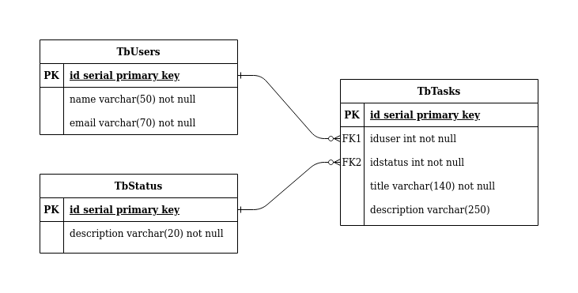

# Desafio 1STi Backend

## Technologies used

- Go Programming Language
- Graphql
- PostgreSQL

## Database diagram



## Graphql Schemas

```graphql
query{
  users{
    id
    name
    email
    tasks{
      id
      title
      description
      status{
        id
        description
      }
    }
  }
}

query{
  user(name:$name){
    id
    name
    email
    tasks{
      id
      title
      description
      status{
        id
        description
      }
    }
  }
}

mutation{
  addUser(name:$name, email:$email)
}

mutation{
  addTask(title:$title, description:$description)
}

mutation{
  updateUserById(id:$id name:$name, email:$email)
}

mutation{
  updateTaskById(id:$id title:$title, description:$description, idUser:$idUser, idStatus:$idStatus)
}
```

For a more detailed (and pretty) information about querys, use Graphiql in localhost:yourport/graphql or read `./schema.go` file

## Running the project

1. Download the project with `git clone` or using `go get github.com/YtaloWill/1sti.challenge.backend`

2. In source, make a .env file or export your environments variables like the example:

```env
    DBUSER=youruserhere
    DBNAME=nameofthedatabase
    DBPASS=yourpassword
    PORT=porttorunserver
```

3. Be sure your database has the tables

4. Run the project with `go run .`
    
    - _Note: The Graphiql (playground) is turned on_

## Running tests

Just use `go tests ./...`

_If you are using a .env file, uncomment file line in ./database/Connect.go#L15 and comment 14 line_
